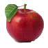

# An-Apple-A-Day (beta)

<!-- PROJECT LOGO -->
<br />
<p align="center">
  <a href="https://github.com/adesuwa-osagie/an-apple-a-day-beta">
    
  </a>

  <h3 align="center">An Apple A Day</h3>

  <p align="center">
    A horror, yet educational, matching game.
  </p>
</p>

<!-- TABLE OF CONTENTS -->
<details open="open">
  <summary><h2 style="display: inline-block">Table of Contents</h2></summary>
  <ol>
    <li>
      <a href="#about-the-project">About The Project</a>
      <ul>
        <li><a href="#built-with">Built With</a></li>
      </ul>
    </li>
    <li>
      <a href="#getting-started">Getting Started</a>
      <ul>
        <li><a href="#prerequisites">Prerequisites</a></li>
        <li><a href="#installation">Installation</a></li>
      </ul>
    </li>
    <li><a href="#usage">Usage</a></li>
    <li><a href="#changes">Changes<a></li>
    <li><a href="#credits">Credits</a></li>
  </ol>
</details>


<!-- ABOUT THE PROJECT -->
## About The Project

[![Product Name Screen Shot][product-screenshot]](https://example.com)


### Built With

* JavaScript
* HTML
* CSS


<!-- GETTING STARTED -->
## Getting Started

To get a local copy up and running follow these simple steps:

### Prerequisites

#### Online
* Visit the <a href="">landing site</a>.

#### Offline
1. Clone the repo from the main branch
   ```sh
   git clone https://github.com/adesuwa-osagie/an-apple-a-day-beta.git
   ```
2. Open the file "index.html" with "Live Server."

### Installation

* No installation required. The game can be play in a web browser.
* You may go <a href="">here</a> to play the game.

<!-- USAGE EXAMPLES -->
## Usage

Use this space to show useful examples of how a project can be used. Additional screenshots, code examples and betas work well in this space. You may also link to more resources.

<!-- CHANGES FROM KUBOW'S VERSION -->

## Changes
This project was made using Kubow's version as a basis. 

The following are JavaScript-related that changes I made:

* Created "clickToSwap" function.
  * Allows the player to click on a swap to switch with another square that is directly to the left, to right, above, or below.

* Added the matchForFive functions for matches of 5 in a row and 5 in a column.

* Added a "Start" screen, and "Game Over" screen with the option to restart the game.
* Added a timer.
* Switched out the colors with images of fruits and vegetables.
* Modified the matches function so only matches of the fruits and vegetables associated with the requested vitamin will count as part of the score
* Player is able to see the name of the fruits when mouse is hovered over its images
* Addressed edges cases regarding the first squares of the grid's rows and the last squares of the rows
    * I.e. For example: Player cannot switch out square at index 7 (i.e. the last square of the first row of the grid) with square at index 8 (i.e. the first square of the second row  of the grid).


<!-- CONTACT -->
## Contact 

[LinkedIn](https://www.linkedin.com/in/adesuwa-osagie/)

[GitHub](https://github.com/adesuwa-osagie")

[Project Link](https://github.com/adesuwa-osagie/an-apple-a-day-beta)


<!-- ACKNOWLEDGEMENTS -->
## Credits

* [Ania Kubow](https://www.youtube.com/c/AniaKub%C3%B3w)
  * This project is based off her tutorial, with my own <a href="#changes">changes</a>. 
  * Her "Candy Crush " tutorial can be view <a href="https://www.youtube.com/watch?v=XD5sZWxwJUk&t=1444s">here</a>.
* [Franks Laboratory](https://www.youtube.com/c/Frankslaboratory)
    * His tutorial on building a 2d JavaScript is how I made the timer for this project.
    * <a href="https://www.youtube.com/watch?v=RTb8icFiSfk">Tutorial</a>
* [David Reid](https://www.youtube.com/channel/UC0CPpbZ088BWsVM2rhpicfQ)
    * How I made the start and game over screens appear
    * <a href="https://www.youtube.com/watch?v=8_zUEh7Vqhs">Tutorial</a>.
* [photoshopCAFE](https://www.youtube.com/channel/UCc0_OX4mqSoRecj3IgJTLtg)
  * Has tutorials on using Adobe Photoshop to edit and merge images